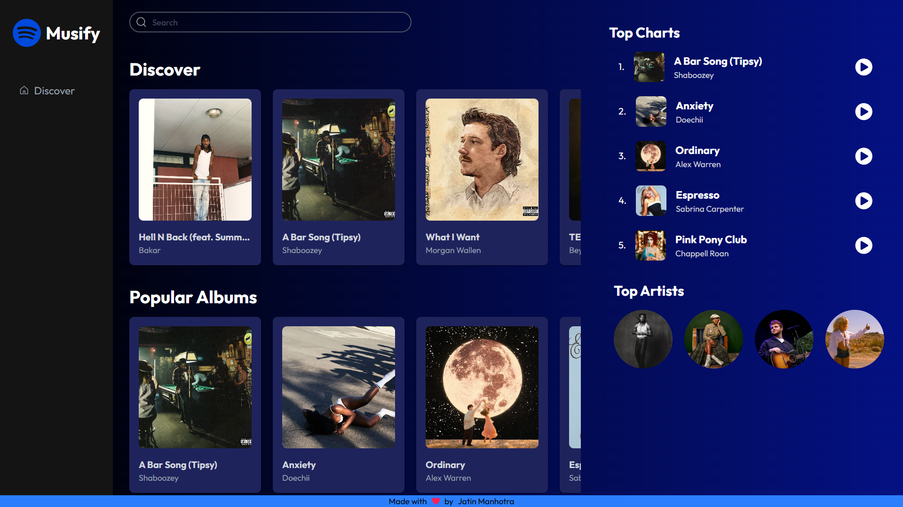
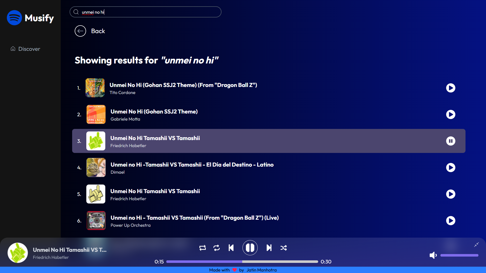
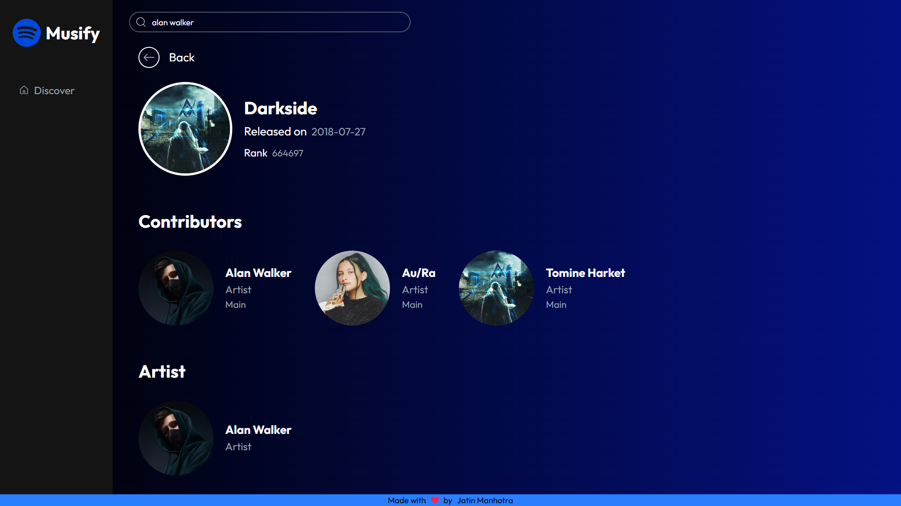

# 🎵 Musify - Music Streaming App

A dynamic and responsive **music streaming** web application built with **React**, inspired by platforms like **Spotify** and **Apple Music**. It allows users to explore trending music, search for songs, view artists and albums, and interact with an intuitive music player with full controls.

---

## 🚀 Live Demo

👉 Check it out - [Musify](https://jatinmanhotra.github.io/react-musify/)

---

## 📸 Screenshots

### 🏠 Discover Page  

### 🔎 Search Results 

### 🎧 Songs Details

### 🎨 Artist Details  

---

## 🔧 Tech Stack

- **React.js** - UI rendering.
- **Redux Toolkit** - Global state management.
- **Redux Toolkit Query (RTK Query)** - API integration and data fetching.
- **React Router DOM** - Routing and dynamic pages.
- **Tailwind CSS** - Utility-first responsive styling.
- **React Icons** - Icon library.
- **Deezer API via RapidAPI** - Tracks, Artists, Albums, Charts, Playlists, Search.

---

## 🎯 Features

### 🌍 Explore Music
- 🔥 View `top charts`, `artists`, `albums`, `playlists` globally using Deezer API.
- 🔎 Search for songs or artists dynamically.
- 👤 View detailed artist profiles and related songs.
- 🦴 Skeleton loaders while the data is being fetched.

### 🎵 Music Playback
- ▶️ Full audio player with:
  - Play/Pause.
  - Skip forward/backward.
  - Shuffle, loop and repeat.
  - Volume control.
  - Seekbar with time sync.
- 💬 Dynamic `status message` when a music control is clicked.

- 🎼 Active song highlighting
  - 🌀 Spinning album art animation when music is playing.

### 🧭 Navigation
- 📍 React-Router-DOM for seamless page navigation.
- 📱 Responsive layout optimized for mobile and desktop.
- 🧩 Sections for Top Charts, Albums, Artists and Playlists.
- 🌐 Dedicated Song, Album, and Artist detail pages.

---

## 🛜 APIs Used

### 🎹 Deezer API (via RapidAPI)
- 🎶 Source for song and artist metadata.
- 🧠 Redux Toolkit with RTK Query for API and state. 
- 🔁 Context API for cross-component communication.

---

## 🌱 Future Enhancements

- 🔑 User authentication (`Firebase/Auth0`)
- 🧠 Smart recommendations based on listening history.
- 🌓 Dark/Light mode toggle.
- 🎤 Lyrics integration with synced playback.
- 🗂️ Add genre filtering and dynamic genres list.
- 💾 Save favorite tracks or artists using localStorage or Firebase.
- 🧭 Infinite scroll for top charts and artist lists.
- 📱 PWA Support for installable experience.
- 🌐 Multi-language support.

---

## 📬 Contact

If you'd like to connect or provide feedback:

- 🌐 [Portfolio](https://jatinmanhotra.github.io/portfolio-2025)
- 📧 Email: jatinmanhotra31@gmail.com
- 💬 WhatsApp: [Chat here](https://wa.me/918493912066?text=Hi%20Jatin%2C%20I%20saw%20your%20Musify%20App!)
- 💼 [LinkedIn](https://www.linkedin.com/in/jatin-manhotra-5b474a347/)
- 📷 [Instagram](https://www.instagram.com/manhotra.31/)
- 💻 [GitHub](https://github.com/JatinManhotra)